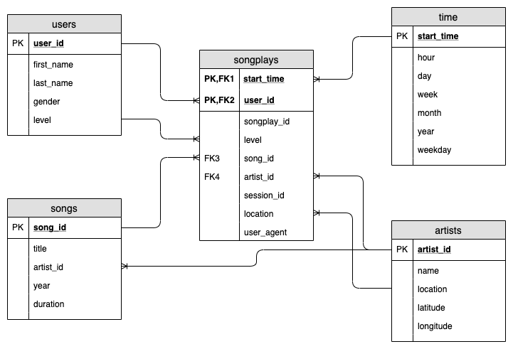

# Project: Data Modeling with PostgreSQL 

## Introduction
A startup called Sparkify wants to analyze the data they've been collecting on songs and user activity on their new music streaming app. The analytics team is particularly interested in understanding what songs users are listening to. Currently, they don't have an easy way to query their data, which resides in a directory of JSON logs on user activity on the app, as well as a directory with JSON metadata on the songs in their app.

## Project Description
It's up on me to use my new knowledge about creating a Postgres database with tables designed to optimize queries on song play analysis. I had to create a database schema and ETL pipeline for this analysis. I should be able to test my database and ETL pipeline by running queries.

In this project, I apply what I've learned on data modeling with Postgres and build an ETL pipeline using Python. To complete the project, I defined fact and dimension tables for a star schema for a particular analytic focus, and wrote an ETL pipeline that transfers data from files in two local directories into these tables in Postgres using Python and SQL.

### Database Schema Design
In the task, it was explicitly specified that the star scheme is to be selected. This is a widely used logical database schema for data warehouse applications. It consists of a fact table and several dimension tables linked star-shaped.

The fact table contains the data to be managed, in our case data records from a chronological list of played songs. 

The dimension tables, on the other hand, contain "descriptive" data, which are intended to improve understanding of the fact table.

The dimension tables have a 1:n relationship with the fact table. This means that exactly one data record in the dimension table can be linked to several data records in the fact table.

In addition to an understandable and comprehensible structure, the advantages of the star schema lie above all in the fast processing of queries. Analytical queries are usually carried out on the basis of the fact table and thus resource-intensive JOINs can usually be dispensed with. Dimension tables are usually kept small. 

The mentioned advantages, like a fast query processing, as well as mostly analytical queries on a fact table, fit very well to the existing application of a music streaming database, where many data sets are generated in a short time and can be processed quickly for analysis.

### ETL pipeline
The ETL pipeline consists of the following tables. Details about the contained parameters and the links can be taken from the ETL diagram.

- `songplays`: This is the fact table which contains the most important features from the streaming data. The foreign keys `start_time` and `user_id` are linked to a primary key because they can define the streamed data sets uniquely.
- `users`: User-specific information such as name, gender and level are stored for a `user_id`.
- `time`: The start time in UTC format is broken down into individual time components. 
- `artists`: Additional information about the artist can be found in this table.
- `songs`: A `song_id` can be described in more detail if interested. In addition to obvious information on title, production year and duration, the `artist_id` is also included. Thus also cover versions can be assigned unambiguously.



## Running scripts

The project can be started from the Python 3 console with the following commands.

```python
%run './create_tables.py'
%run './etl.py'
```

Alternatively, the terminal console can also be used.

```bash
python create_tables.py
python etl.py
```

Then the ETL already described with the available data is ready.

### Explanation of files

In the following, all files and folders are briefly described:

`./data/`: Folder with records from the logging files of the streaming service and detailed information about the songs in JSON format.

`./create_tables.py`: Python scripts for creating the database and the tables, as well as for deleting them

`./etl.ipnb`: Jupyter Notebook with explanations to the individual steps in the ETL process.

`./etl.py`: Python scripts for processing the data from the song files and the log files. Furthermore a script for processing all files in the folder structures.

`./README.md`: This file with explanations to the project.

`./sql_queries.py`: Compilation of all SQL queries to delete, create, fill tables with records and extract information about specific songs.

`./test.ipnb`: Jupyter notebook with SQL queries to check the contents of each table.