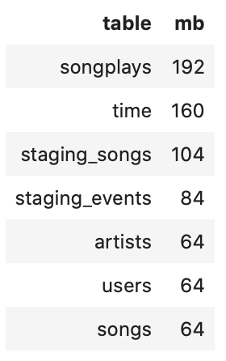

# Project 3: Data Warehouse with Amazon Redshift

In this project I should take over the role of the data engineer of a music streaming startup, called Sparkify. Because of a growing user base and song database I should move the processes and data onto the cloud. Their data resides in S3, in a directory of JSON logs on user activity, as well as a directory with JSON metadata on the songs.

In this project, I build an ETL pipeline for a database hosted on Redshift with Python. I copy data from S3 to staging tables on Redshift and execute SQL statements that create the analytics tables from these staging tables.

## Getting Started

The project contains the following files:

[create_tables.py](./create_tables.py): Script to start the queries to create the tables on the AWS Redshift Cluster.

[etl.py](./etl.py): Script to start the queries for the ETL process to copy the data from the S3-bucket to the transfer tables and then to insert the data in the productive tables.

[sql_queries.py](./sql_queries.py): Collection of all the used SQL-queries to drop, create, copy and insert tables.

[dwh.cfg](./dwh.cfg): Config file with parameters to run the mentioned scripts.

[dwh-create.cfg](./dwh-create.cfg): Config file with parameters to run the following Python Notebook.

[project.ipynb](./project.ipynb): Jupyter Notebook with all the following steps:

- Prepare EC2, IAM and Redshift
- Connect to Redshift Cluster 
- Clean cluster and stage data
- Copy S3 data to the staging tables
- Define target tables
- Insert data into tables
- Validation and Performance Testing
- Clean up resources

[project.html](./project.html): Example of the Jupyter Notebook with a complete run. 

### Prerequisites

The scripts use the AWS-SDK for Python with the following modules:

- pandas
- boto3
- json

The first two modules can be installed with the following commands. `json` is a built-in module.

```python
pip install pandas
pip install boto3
```

You also need access to the AWS services:

- Redshift
- IAM
- S3

### Installing

In order to run the scripts you have to do the following steps in a python console.

Create the necessary tables:

```python
%run 'create_tables.py'
```

Start the ETL process to insert the data into the tables:

```python
%run 'etl.py'
```

Alternatively you can run all the steps in `project.ipynb`.

## Designing Tables

In the task, it was explicitly specified that the star schema is to be selected. This is a widely used logical database schema for data warehouse applications. It consists of a fact table `songplays` and several dimension tables for ``users ``, `songs`, ``artists`` and ``time`` linked star-shaped.

The mentioned advantages, like a fast query processing, as well as mostly analytical queries on a fact table, fit very well to the existing application of a music streaming database, where many data sets are generated in a short time and can be processed quickly for analysis.


## Tuning Table Design

In order to optimize database access, it is necessary to consider the distribution of data when creating the tables. With Amazon Redshift the clients access one Leader Node to which the data is distributed to several Compute Nodes and here again to different Node Slices. By specifying a column as a distribution key it is possible to control the distribution of data across the slices. This has a positive effect on parallel processing when loading the data and executing queries.

### Select Sort Keys

Redshift stores data on disk in sorted order according to the sort key which can be one or more columns of a table. This has an important effect on disk I/O, columnar compression and query performance.

I specify the following columns in the respective tables as Sort Keys:

- `start_time` in `songplays`: I assume that queries are mainly executed at certain times. Sorting the data according to the timestamp column, in this case `start_time`, is recommended.
- `user_id` in `users`, `song_id` in `songs`, `start_time` in `time` are often used as join columns of the distribution tables as sort keys.

### Select Distribution Styles

When you load data into a table, Amazon Redshift distributes the rows of the table among the node slices according to the distribution style of the table. This behavior is also used to parallelize and optimize the processing of database queries.

Rows from connection tables should be combined so that they are on the same slices and less data has to be moved while the query is executed.
To distribute the workload, it is recommended that you distribute the data evenly among the slices in a cluster.

Normally, copies are stored from small tables with `ALL` to all nodes. With `EVEN`, all lines are distributed evenly, and with `KEY` the system ensures that lines with the same contents in this column are stored on the same slice.



`songplays` and `time` are by far the largest tables and can be evenly distributed using the distribution key `start_time`.

`users`, `songs` and `artists` are the smallest tables and can be distributed to all nodes to improve performance.


### Performance Testing

The performance of the system can be checked by creating a query plan. To do this, it makes sense to think up a test query and apply it to the system.

I have created a query that generates an overview of the number of all the different songs and artists of a user that have taken place in a given month.

```sql
SELECT sp.user_id, u.last_name, count(distinct sp.song_id) AS songs_played, count(distinct sp.artist_id) AS artists_played
FROM songplays sp
JOIN users u
ON sp.user_id = u.user_id
JOIN songs s
ON sp.song_id = s.song_id
JOIN time t
ON sp.start_time = t.start_time
JOIN artists a
ON sp.artist_id = a.artist_id
WHERE t.month = 11
GROUP BY 1, 2
ORDER BY 3 DESC, 4 DESC;
```

The query plan can be output by prefixing it with `EXPLAIN`.


`DS_DIST_ALL_NONE` and `DS_DIST_NONE` show both that no redistribution is required which is good according to the [documentation](https://docs.aws.amazon.com/redshift/latest/dg/c_data_redistribution.html). 

