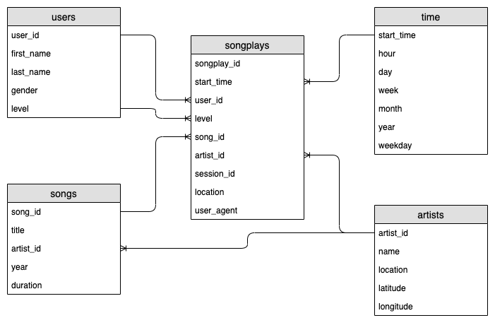

# Project 4: Data Lake on AWS

## Description

### Introduction

A music streaming startup, Sparkify, has grown their user base and song database even more and want to move their data warehouse to a data lake. Their data resides in S3, in a directory of JSON logs on user activity on the app, as well as a directory with JSON metadata on the songs in their app.

As their data engineer, I'm tasked with building an ETL pipeline that extracts their data from S3, processes them using Spark, and loads the data back into S3 as a set of dimensional tables. This will allow their analytics team to continue finding insights in what songs their users are listening to.

### Project Description

In this project, I build an ETL pipeline for a data lake hosted on S3. To complete the project, Therefore I load data from S3, process the data into analytics tables using Spark, and load them back into S3. I deploy this Spark process on a cluster using AWS.

## Getting Started

The project contains the following files:

[data](./data): Folder with example data to run the scripts on the local computer.

[etl.py](./etl.py): Script to run the ETL process with the following steps:

1. parsing configuration from [dl.cfg](./dl.cfg)
2. creating a Spark Session
3. processing song data by using Spark
   1. reading data from some folders on a S3-bucket
   2. extracting columns to create dimension tables for songs and artists
   3. writing tables to S3-bucket
4. processing log data by using Spark
   1. reading data from some folders on a S3-bucket
   2. filtering relevant data
   3. parsing original timestamp
   4. extracting columns to create dimension tables for users and time
   5. creating songplays fact table 
   6. writing tables to S3-bucket

[dl.cfg](./dl.cfg): Config file with parameters to run the scripts.

[project.ipynb](./project.ipynb): Jupyter Notebook with all the steps in [etl.py](./etl.py). 

### Prerequisites

The script uses PySpark, a high-level API for Spark in Python which can be installed with the following commands.

```python
pip install pyspark
```

You also need access to the AWS services:

- EC2
- IAM
- S3
- EMR

### Installing

In order to run the scripts you have to do the following steps in a python console.

Start the ETL process to load the data, create the tables and save them on another S3-bucket:

```python
%run 'etl.py'
```

## Designing Tables

In the task, it was explicitly specified that the star schema is to be selected. This is a widely used logical database schema for data warehouse applications. It consists of a fact table `songplays` and several dimension tables for ``users ``, `songs`, ``artists`` and ``time`` linked star-shaped.

The mentioned advantages, like a fast query processing, as well as mostly analytical queries on a fact table, fit very well to the existing application of a music streaming database, where many data sets are generated in a short time and can be processed quickly for analysis.




